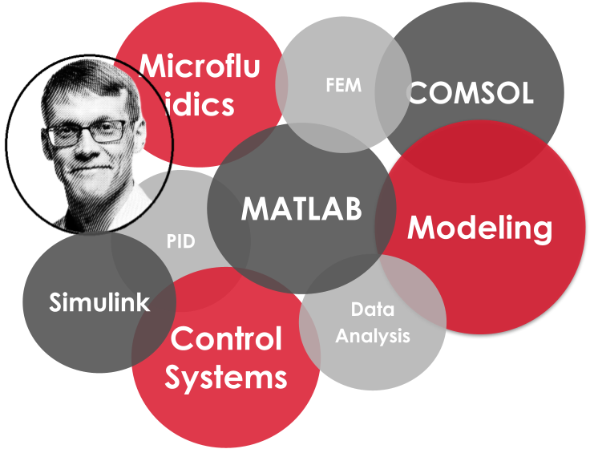

<!-- # A-J Mäki, PhD & Hobby Scientist -->
<h1 align="center">
    
</h1>

<!-- changing text
lines=Hi+There!+👋;+I'm+AJ+Mäki!;" />
Hello! I am A-J, former postdoc research and current hobby scientist. 
-->

Welcome to my **research outcomes** pages
- [my Google Scholar profile](https://scholar.google.com/citations?user=bmCs6M0AAAAJ "Scholar profile")
- [my doctoral dissertation](https://urn.fi/URN:ISBN:978-952-15-4174-2 "dissertation")
- [ORCHID 0000-0001-7565-3530](https://orcid.org/0000-0001-7565-3530 "orchid")

> **NOTE** 
> Since March 2023, I have been working as a **data engineer at [Solita](https://www.solita.fi/ "Solita")**, more about that can be found [ here](https://anahill.github.io/portfolio/ "my work portfolio"). 

  Please free to contact me
   
  
  
  

 

<!-- ## 🛠️ Main Research Topics, Areas, and Tools -->
# My Research
My research focused on **control engineering**, **microfluidics**, **mathematical modeling** using both **Simulink & MATLAB** and **FEM** (**COMSOL**), and **data analysis** with **MATLAB**.

<!-- TODO: Bubble pic academics + data engineer&nerd -->

<!-- **Research areas**: microfluidics, control engineering, modeling, fem, data analysis, pdms, ips cells

**Main tools**: MATLAB & Simulink, COMSOL, Soft lithography (pdms) -->
<!--   

 
 -->

<!-- ############# -->
# Education
D. Sc. (Tech.), Tampere University of Technology, Aug 2018
- Doctoral dissertation '_Modeling and Control of Microscale Cell Culture Environments_' available [here](https://urn.fi/URN:ISBN:978-952-15-4174-2 "trepo.tuni.fi")

> My Ph.D. work involved designing and implementing automation and control systems, mathematical modeling and data handling using MATLAB and Simulink, FEM simulations with COMSOL, and much laboratory and design work related to microsystems & microfluidics.

M. Sc. (Tech.), Tampere University of Technology, July 2010  
- Thesis '_Optically induced electric fields and their use in microfluidics and cell manipulation applications_' is available [here](https://urn.fi/URN:NBN:fi:tty-201008171286 "trepo.tuni.fi") and was presented in the 2nd European Conference on Microfluidics-Microfluidics 2010, Toulouse, December 8-10, 2010. 
- Student exchange, Hong Kong Polytechnic University, 2006-2007  

<!-- ############# WORK ############# -->
# Academic Work Experience

<!-- ### Hobby Scientist ### -->
## Hobby Scientist (_Jan 2025 - Present_)
Currently, I focus on continuous learning and on my hobby projects, some of them listed below. But, please be free to contact me if you would have some research study in your mind, as doing science is fun! If you got interested in, you can ask more about my research from Professor Pasi Kallio (check [Micro- and Nanosystems Research Group page](https://research.tuni.fi/mst/)). Other references available upon request.

> **NOTE** 
> These are on-going projects that _might_ be finished at one day. :) 

### [My Tips for Academy](https://github.com/AnaHill/Tips-for-Academy)
> Sharing my tips & tricks for the academic career. For example, how to make "version control" clever in the case of you are not familiar with git etc

## [How to write scientific paper]() 
 repo coming soon(ish)
> Continuation to my [Write LaTex Documents using Word](https://github.com/AnaHill/Write-LaTeX-documents-using-Word), describing how you can combine VS Code + Markdown + Pandoc + LaTeX & Bibtex to easily write and publish high quality papers.

## [How to set up Python environments for data projects](https://github.com/AnaHill/How-to-set-up-Python-environments-for-data-projects)
> My proposal how to set up environment for (hobby) data projects.

<!-- ### Hourly Researcher ### -->
## Hourly Researcher @ Tampere University (_Nov 2022 - Dec 2024_)
I continued to work with Professor Pasi Kallio, finishing following publications. 

Yrjänäinen et al. (2024) https://doi.org/10.1038/s41598-024-74493-3 (**last author**)
> I lead a group of  multidisciplinary research team that developed a novel "body-on-chip" platform for vascularized 3D cell co-cultures studies

Mäki et al. (2024) https://doi.org/10.1109/TASE.2023.3309668
> I developed a fuzzy controller and a mathematical model to simulate and control temperature-dependency of beating human cardiomyocyte cultures

Mäki et al. (2023) 
> Opinion: The correct way to analyze FP signals, published in (not peer-reviewed)

<!-- ### Postdoc ### -->
## Postdoctoral Research Fellow @ Tampere University (_Sep 2018 - Nov 2022_)
My research focused on **microsystems**, **microfluidics**, **control engineering**, **data analysis** with MATLAB.
My main tools were **MATLAB**, **Simulink**, **COMSOL (FEM)**, and **soft lithography (PDMS)**.

I worked as a postdoc in professor Pasi Kallio's team [1, 2](), where I developed data engineering and analysis solutions to automatize data analysis of several challenging biosignals and data types (e.g. HDF5, .csv, image, and video). My work involved GUI development and implementation of machine learning solutions in MATLAB environment. [3-8]()

Additionally, I worked as professor Kallio’s Vice-PI in a multidisciplinary CoEBoC team [2]() combining cell biologists and engineers, and led a group of researchers developing a novel "body-on-chip" platform for vascularized 3D cell co-cultures studies [11]().

**Selected References**
1. Micro- and Nanosystems Research Group, [https://research.tuni.fi/mst/](https://research.tuni.fi/mst/)
2. CoEBoC, Centre of Excellence in Body on-Chip Research, [https://research.tuni.fi/coeboc/](https://research.tuni.fi/coeboc/)
3. DatAnalyzer, [Github-repo](https://github.com/AnaHill/DatAnalyzer)
4. Häkli et al. (2022) https://doi.org/10.1155/2022/9438281
5. Häkli et al. (2021) https://doi.org/10.1038/s41598-021-83740-w
6. Mykuliak et al. (2022) https://doi.org/10.3389%2Ffbioe.2022.764237
7. Gaballah et al. (2022) https://doi.org/10.3390/cells11061045
8. Skogberg et al. (2022) https://doi.org/10.1039/D1NR06937C
9. Tornberg et al. (2022) https://doi.org/10.1007/s10544-022-00634-y 
10. Peussa et al. (2022) https://doi.org/10.1371/journal.pone.0268570
11. Yrjänäinen et al. (2024) https://doi.org/10.1038/s41598-024-74493-3 

## Doctoral Researcher @ Tampere University of Technology (_Sep 2011 - Aug 2018_)

My main responsibility in the multidisciplinary project was to developed the heat control systems for the autonomous cell cultivation platforms. I was also heavily involved in mathematical modeling and optimization of the cell culture environments, for examaple using FEM-based simulations.

**Selected References**
1. Doctoral dissertation (2018), titled 'Modeling and Control of Microscale Cell Culture Environments' is available in https://urn.fi/URN:ISBN:978-952-15-4174-2
2. Mäki et al. (2018) https://doi.org/10.1177/2472630318768710
3. Mäki et al. (2018) https://doi.org/10.1109/TASE.2016.2613912
4. Mäki et al. (2015) https://doi.org/10.1016/j.ces.2015.06.065
1. Mäki et al. (2015) https://doi.org/10.1115/1.4028501
2. Kreutzer et al. (2017) https://doi.org/10.1016/j.jneumeth.2017.01.019
3. Rajan et al. (2020) https://doi.org/10.1109/ACCESS.2020.3001191
4. Skogberg et al. (2017) https://doi.org/10.1021/acs.biomac.7b00963

## Project Researcher @ Tampere University of Technology (_Aug 2010 - Sep 2011_)

My study was related to immunoassay in microchannels and how they could be used in patient diagnostic.

## Thesis Worker and Research Assistant @ Tampere University of Technology (_June 2006 - Aug 2010_)
I worked in OPTIMI (Optically actuated microfluidics) project funded by Academy of Finland and collaborated with researchers from Helsinki University of Technology. My task was to model and test optically induced electric fields and to study how they could be used in microfluidics applications. [1, 2]

Selected References:
1. Master thesis (2010), titled 'Optically induced electric fields and their use in microfluidics and cell manipulation applications' is available in https://urn.fi/URN:NBN:fi:tty-201008171286
2. Mäki et al. (2010).  'Modeling continuous optoelectrowetting device', in Proceedings of the 2nd European Conference on Microfluidics - Microfluidics 2010, Toulouse, December 8-10, 2010, https://researchportal.tuni.fi/en/publications/modeling-continuous-optoelectrowetting-device

<!-- ############# Projects ############# -->
# Projects
## Coeboc
CoEBOC, '_Centre of Excellence in Body on-Chip Research_' is Academy of Finland funded project for the years 2018-2025. [1] 
The ultimate goal of CoEBoC is to revolutionize healthcare by developing and applying body on-chip (BoC) technology and enable more accurate and efficient drug testing, as well as by discovering new tools for diagnosing and treating diseases at the cellular level.

CoEBoC brought together six research groups from Tampere University: microsystems and microfluidics, biomaterials, adult stem cell research, cardiac and neural cell cultures, and computational biophysics and imaging.

**Role**: Postdoctoral Researcher in professor Pasi Kallio's team [2], my main tasks were analyzing cell culture data, numerical simulations (FEM), leading a group that developed a novel "body-on-chip" platform for vascularized 3D cell co-cultures [3], and designing control systems [4]. 

**Keywords**: microsystems, microfluidics, fem, data analysis, control engineering, iPS, adult stem cells, cardiomyocyte, neuron, imaging

**References**
1. CoEBoC, Centre of Excellence in Body on-Chip Research, https://research.tuni.fi/coeboc/
2. Micro- and Nanosystems Research Group, https://research.tuni.fi/mst/ 
3. Yrjänäinen et al. (2024) https://doi.org/10.1038/s41598-024-74493-3 
4. Mäki et al. (2024) https://doi.org/10.1109/TASE.2023.3309668

## HS: Human Spare Parts, 2011-2019
In this multidisciplinary, research-oriented Business Finland (former TEKES) Human Spare Parts - project between Tampere Universities, the goal was to develop stem cell-based advanced in vitro models and solutions for cardiac, neural, bone, and adipose diseases and traumas. It combined tens of experts from different research fields, such as microsystems, stem cells, biomaterials, and biomedical engineering, and produced several leading edge in vitro models and solutions.

**Role**: Doctoral Researcher in professor Pasi Kallio's team, I was responsible for simulate and developed novel control solutions for in vitro cell culture environments. [1]

**Keywords**: microsystems, microfluidics, iPS, adult stem cells, biomaterials, biomedical engineering

**References**: 
See _Selected References_ list in [Doctoral Researcher](#doctoral-researcher--tampere-university-of-technology-sep-2011---aug-2018) section.

<!-- ### Repos/Other project ### -->
## DatAnalyzer: The correct way to analyze FP signals
Tools to load, visualize, and analyse data using MATLAB.
- [DatAnalyzer home page](https://github.com/AnaHill/DatAnalyzer)  
- Publication _Opinion: The correct way to analyze FP signals_ available in [Zenodo](https://doi.org/10.5281/zenodo.10205591)

Tools and keywords: **MATLAB**, **data analysis**, **MEA**, **hiPS-CM**

Developed method and tool (DatAnalyzer) to analyze field potential (FP) signals from 2D human induced pluripotent stem cells derived cardiomyocyte (hiPSC-CM) cultures. I summarized how FP signals have been analyzed various, sometimes even contradictory, ways in the literature, and proposed my own methdod that could be considered.

Software has been used at least in the following publications:
- Gaballah et al. (2022) https://doi.org/10.3390/cells11061045
- Häkli et al. (2022) https://doi.org/10.1155/2022/9438281
- Häkli et al. (2021) https://doi.org/10.1038/s41598-021-83740-w

## Write LaTeX documents together with co-authors that use MS Word
Project [page](https://github.com/AnaHill/Write-LaTeX-documents-using-Word) explains how to use this tool

Tools: **Powershell**, **Pandoc**, **LaTeX**, **Markdown**

Do you want to use LaTeX for you (scientific) paper, but struggling when co-authors, such as you supervisor, do not use it, and therefore Word is preferred? This is tool for you! Minimize hasszle of exporting files in different formats and copy-paste text from one format to another, while still be able to write LaTeX-documents and publish high-quality papers.

For example, this paper freely available [here](https://ieeexplore.ieee.org/document/10242335) was written using this tool.
> A. -J. Mäki, J. T. Koivumäki, J. Hyttinen and P. Kallio, "Simulation-Based Study of Control Strategies for Beating of Human Cardiomyocyte Cultures," in IEEE Transactions on Automation Science and Engineering, doi: 10.1109/TASE.2023.3309668.

## Plot Fluke Ti400 thermal images
Plot Thermal images from Fluke Ti400 using MATLAB, code available in: https://github.com/AnaHill/Plot_Fluke_Ti400_thermal_images

Tools and keywords: **MATLAB**, **PowerShell**, **thermal images**

Used at least in this publication 
> Skogberg et al. (2022), https://doi.org/10.1039/D1NR06937C

# Language
Finnish: Mother tongue
English: C2 (full professional working proficiency)
Swedish: A2
German: A1
Mandarin: A1

# Merits
- Invention disclosures
  <!-- - Miinan keksari  -->
  - TKS0222021 MEA-signaalin analyysityökalu (”MEA analysis tool”), granted 05/2021
  - TKS0612020 Pilarivapaa 3D monisolukasvatuschippi (”Barrier-free 3D co-culture chip”), granted 06/2020
- Member of the Organizing Committee, Nordic Organ on a Chip Symposium 2019, 08/2019
- Member of Future Finders network, Tampere University 2019-2022
- Finnish military rank: second lieutenant

<!-- ############# -->
# Publications
See also [my Scholar profile](https://scholar.google.com/citations?user=bmCs6M0AAAAJ).

> **NOTE** 
> This section will be updated, need to modify bad .bib file, maybe convert then here https://bibtex.online/. 

## Selected Publications

  
 List 
  
> Yrjänäinen, Alma, Elina, Mesiä, Ella, Lampela, Joose, Kreutzer, Jorma, Vihinen, Kaisa, Tornberg, Hanna, Vuorenpää, Susanna, Miettinen, Pasi, Kallio, and **Antti-Juhana, Mäki**. "Barrier-free, open-top microfluidic chip for generating two distinct, interconnected 3D microvascular networks".Scientific Reports 14, no.1 (2024): 22916.

> 

## All Publications

  
 List 
  

> A. -J. Mäki, J. T. Koivumäki, J. Hyttinen and P. Kallio, "Simulation-Based Study of Control Strategies for Beating of Human Cardiomyocyte Cultures," in IEEE Transactions on Automation Science and Engineering, doi: 10.1109/TASE.2023.3309668.

> Yrjänäinen, Alma, Elina, Mesiä, Ella, Lampela, Joose, Kreutzer, Jorma, Vihinen, Kaisa, Tornberg, Hanna, Vuorenpää, Susanna, Miettinen, Pasi, Kallio, and **Antti-Juhana, Mäki**. "Barrier-free, open-top microfluidic chip for generating two distinct, interconnected 3D microvascular networks".Scientific Reports 14, no.1 (2024): 22916.

>Mykuliak, A, A, Yrjänäinen, AJ, Mäki, A, Gebraad, E, Lampela, M, Kääriäinen, TK, Pakarinen, P, Kallio, S, Miettinen, and H, Vuorenpää. "Vasculogenic potency of bone marrow-and adipose tissue-derived mesenchymal stem/stromal cells results in differing vascular network phenotypes in a microfluidic chip. Front Bioeng Biotechnol 10: 764237".Frontiers in Bioengineering and Biotechnology| www. frontiersin. org 10 (2022).

>Mäki, Antti-Juhana, and others. "Optically induced electric fields and their use in microfluidics and cell manipulation applications".Journal is required! (2010).

>Maki, Antti-Juhana, Pekka, Ronkanen, Quan, Zhou, and Pasi, Kallio. "Modeling continuous optoelectrowetting device." . In 2nd European Conference on Microfluidics (pp. $μ$FLU10–270).2010.
>
>Mäki, Antti-Juhana, Joose, Kreutzer, and Pasi, Kallio. "Modeling Drug Delivery in Gravity-Driven Microfluidic System." . In 12th International Conference on Nanochannels, Microchannels, and Minichannels (ICNMM2014), 2014, in press.2014.
>
>Mäki, Antti-Juhana, Samu, Hemmilä, Juha, Hirvonen, Nathaniel Narra, Girish, Joose, Kreutzer, Jari, Hyttinen, and Pasi, Kallio. "Modeling and Experimental Characterization of Pressure Drop in Gravity-Driven Microfluidic Systems".Journal of Fluids Engineering 137, no.2 (2015): 021105.
>
>Mäki, A-J, M, Peltokangas, J, Kreutzer, S, Auvinen, and P, Kallio. "Modeling carbon dioxide transport in PDMS-based microfluidic cell culture devices".Chemical Engineering Science 137 (2015): 515–524.
>
>Mäki, Antti-Juhana, Anton, Kontunen, Tomi, Ryynänen, Jarmo, Verho, Joose, Kreutzer, Jukka, Lekkala, and Pasi, Kallio. "Design and Simulation of a Thermal Flow Sensor for Gravity-Driven Microfluidic Applications".Journal is required! (2016).
>
>Mäki, Antti-Juhana, Tomi, Ryynänen, Jarmo, Verho, Joose, Kreutzer, Jukka, Lekkala, and Pasi J, Kallio. "Indirect temperature measurement and control method for cell culture devices".IEEE Transactions on Automation Science and Engineering 15, no.2 (2018): 420–429.
>
>Kreutzer, Joose, Laura, Ylä-Outinen, Antti-Juhana, Mäki, Mervi, Ristola, Susanna, Narkilahti, and Pasi, Kallio. "Cell culture chamber with gas supply for prolonged recording of human neuronal cells on microelectrode array".Journal of Neuroscience Methods 280 (2017): 27–35.
>
>Kreutzer, Joose, Marlitt, Viehrig, Antti-Juhana, Mäki, Pasi, Kallio, Rolle, Rahikainen, and Vesa, Hytönen. "Pneumatically actuated elastomeric device for simultaneous mechanobiological studies and live-cell fluorescent microscopy." . In 2017 International Conference on Manipulation, Automation and Robotics at Small Scales (MARSS) (pp. 1–5).2017.
>
>Skogberg, Anne, Antti-Juhana, Mäki, Marja, Mettänen, Panu, Lahtinen, and Pasi, Kallio. "Cellulose Nanofiber Alignment Using Evaporation-Induced Droplet-Casting, and Cell Alignment on Aligned Nanocellulose Surfaces".Biomacromolecules 18, no.12 (2017): 3936–3953.
>
>Mäki, Antti-Juhana, Jarmo, Verho, Joose, Kreutzer, Tomi, Ryynänen, Dhanesh, Rajan, Mari, Pekkanen-Mattila, Antti, Ahola, Jari, Hyttinen, Katriina, Aalto-Setälä, Jukka, Lekkala, and others. "A Portable Microscale Cell Culture System with Indirect Temperature Control".SLAS TECHNOLOGY: Translating Life Sciences Innovation 23, no.6 (2018): 566–579.
>
>Mäki, Antti-Juhana. "Modeling and Control of Microscale Cell Culture Environments." (2018).
>
>Rajan, Dhanesh Kattipparambil, Antti-Juhana, Mäki, Mari, Pekkanen-Mattila, Joose, Kreutzer, Tomi, Ryynänen, Hannu, Välimäki, Jarmo, Verho, Jussi T, Koivumäki, Heimo, Ihalainen, Katriina, Aalto-Setälä, and others. "Cardiomyocytes: Analysis of Temperature Response and Signal Propagation Between Dissociated Clusters Using Novel Video-Based Movement Analysis Software".IEEE Access 8 (2020): 109275–109288.
>
>Häkli, Martta, Joose, Kreutzer, Antti-Juhana, Mäki, Hannu, Välimäki, Henna, Lappi, Heini, Huhtala, Pasi, Kallio, Katriina, Aalto-Setälä, and Mari, Pekkanen-Mattila. "Human induced pluripotent stem cell-based platform for modeling cardiac ischemia".Scientific reports 11, no.1 (2021): 4153.
>
>Kreutzer, Joose, Marlitt, Viehrig, Rolle, Rahikainen, Antti, Mäki, Vesa P, Hytönen, and Pasi, Kallio. "Cell Stretching Device for Live-Cell Confocal Microscopy." . In Annual International Conference of the IEEE Engineering in Medicine and Biology Society.2016.
>
>Mäki, Antti, Dhanesh Kattipparambil, Rajan, Joose, Kreutzer, Anne, Skogberg, Mari, Pekkanen-Mattila, Jarmo Antero, Verho, Tomi, Ryynänen, Hannu, Välimäki, Antti, Ahola, Jari, Hyttinen, and others. "Platform for controlling cellular environment".Journal is required! (2018).
>
>Vilkko, Matti, J, Kaivosoja, Antti, Mäki, and Pasi, Kallio. "Compensation of detent torque in microstepping of linear permanent magnet stepping motors." . In 12th International Conference on New Actuators, Actuator 2010, Bremen, Germany, June 2010.2010.
>
>Mäki, Antti-Juhana, Joose, Kreutzer, and Pasi, Kallio. "Optimizing Elastomeric Mechanical Cell Stretching Device".Journal is required! (2018).
>
>Kreutzer, Joose, Disheet, Shah, Kaisa, Tornberg, Antti, Mäki, Mari, Pekkanen-Mattila, Katriina, Aalto-Setälä, and Pasi, Kallio. "Mini-incubator for prolonged hypoxia studies on MEA: Effect of hypoxia for IPSC-derived cardiomyocytes." . In MEA Meeting 2018| 11th International Meeting on Substrate Integrated Microelectrode Arrays.2018.
>
>Mäki, Antti, and Pasi, Kallio. "Modeling in vitro cell culture microenvironments." . In The Micronano System Workshop (MSW) (pp. 61).2018.
>
>Mäki, Antti-Juhana, Joose, Kreutzer, Xiaohui, Zhu, Jarmo, Verho, Tomi, Ryynänen, Yong, Yue, Jukka, Lekkala, and Pasi, Kallio. "Indirect Temperature Measurement in a Cell Culture Device".Journal is required! (Year is required!).
>
>Skogberg, Anne, Sanna, Siljander, Antti-Juhana, Mäki, Mari, Honkanen, Alexander, Efimov, Markus, Hannula, Panu, Lahtinen, Sampo, Tuukkanen, Tomas, Björkqvist, and Pasi, Kallio. "Self-assembled cellulose nanofiber–carbon nanotube nanocomposite films with anisotropic conductivity".Nanoscale 14, no.2 (2022): 448–463.
>
>Mykuliak, Anastasiia, Alma, Yrjänäinen, Antti-Juhana, Mäki, Arjen, Gebraad, Ella, Lampela, Minna, Kääriäinen, Toni-Karri, Pakarinen, Pasi, Kallio, Susanna, Miettinen, and Hanna, Vuorenpää. "Vasculogenic potency of bone marrow-and adipose tissue-derived mesenchymal stem/stromal cells results in differing vascular network phenotypes in a microfluidic chip".Frontiers in Bioengineering and Biotechnology 10 (2022): 764237.
>
>Gaballah, Mahmoud, Kirsi, Penttinen, Joose, Kreutzer, Antti-Juhana, Mäki, Pasi, Kallio, and Katriina, Aalto-Setälä. "Cardiac Ischemia On-a-Chip: Antiarrhythmic Effect of Levosimendan on Ischemic Human-Induced Pluripotent Stem Cell-Derived Cardiomyocytes".Cells 11, no.6 (2022): 1045.
>
>Peussa, Heidi, Joose, Kreutzer, Elina, Mäntylä, Antti-Juhana, Mäki, Soile, Nymark, Pasi, Kallio, and Teemu O, Ihalainen. "Pneumatic equiaxial compression device for mechanical manipulation of epithelial cell packing and physiology".PloS one 17, no.6 (2022): e0268570.
>
>Tornberg, Kaisa, Hannu, Välimäki, Silmu, Valaskivi, Antti-Juhana, Mäki, Matias, Jokinen, Joose, Kreutzer, and Pasi, Kallio. "Compartmentalized organ-on-a-chip structure for spatiotemporal control of oxygen microenvironments.".Biomedical Microdevices 24, no.4 (2022): 34–34.
>
>Häkli, Martta, Joose, Kreutzer, Antti-Juhana, Mäki, Hannu, Välimäki, Reeja Maria, Cherian, Pasi, Kallio, Katriina, Aalto-Setälä, and Mari, Pekkanen-Mattila. "Electrophysiological Changes of Human-Induced Pluripotent Stem Cell-Derived Cardiomyocytes during Acute Hypoxia and Reoxygenation".Stem cells international 2022, no.1 (2022): 9438281.
>
>Mykuliak, Anastasiia, Alma, Yrjänäinen, Antti-Juhana, Mäki, Arjen, Gebraad, Ella, Lampela, Minna, Kääriäinen, Toni-Karri, Pakarinen, Pasi, Kallio, Susanna, Miettinen, and Hanna, Vuorenpää. "Vasculogenic Potency of Bone Marrow-and Adipose Tissue-Derived Mesenchymal Stem/Stromal Cells".Organ Microenvironment in Vascular Formation, Homeostasis and Engineering 16648714 (2023).
>
>Mäki, Antti-Juhana, Jussi T, Koivumäki, Jari, Hyttinen, and Pasi, Kallio. "Simulation-Based Study of Control Strategies for Beating of Human Cardiomyocyte Cultures".IEEE Transactions on Automation Science and Engineering (2023).
>
>Mäki, Antti-Juhana. "Opinion: The correct way to analyze FP signals." (2023).
>
>Häkli, M, H, Välimäki, A, Mäki, J, Kreutzer, D, Rajan, Tomi, Ryynänen, P, Kallio, K, Aalto-Setälä, and M, Pekkanen-Mattila. "Modeling Cardiac Ischemia with Human Induced Pluripotent Stem Cell-Derived Cardiomyocytes." . In EUROOoCs conference of European Organ-on-Chip Society.2020.
>
>Salpavaara, T, A, Nummi, J, Verho, Tomi, Ryynänen, J, Väliaho, A, Mäki, J, Lekkala, and P, Kallio. "Understanding electrical signals in volume conductor on MEA." . In 12th International Conference on Microelectrode Arrays for Life Sciences.2022.
>
>Välimäki, H, A, Mäki, DK, Rajan, M, Pekkanen-Mattila, J, Kreutzer, Tomi, Ryynänen, J, Verho, K, Aalto-Setälä, and P, Kallio. "Combined electrophysiological and video-based motion analysis for human induced pluripotent stem cell-derived cardiomyocytes in hypoxia." . In EUROOoCs conference of European Organ-on-Chip Society.2021.
>
>Ryynänen, Tomi, A, Karttu, A, Mäki, L, Sukki, J, Väliaho, H, Välimäki, D, Rajan, J, Kreutzer, J, Lekkala, and P, Kallio. "Custom-designed 2D microelectrode array fabrication." . In EUROOoCs conference of European Organ-on-Chip Society.2019.
>

